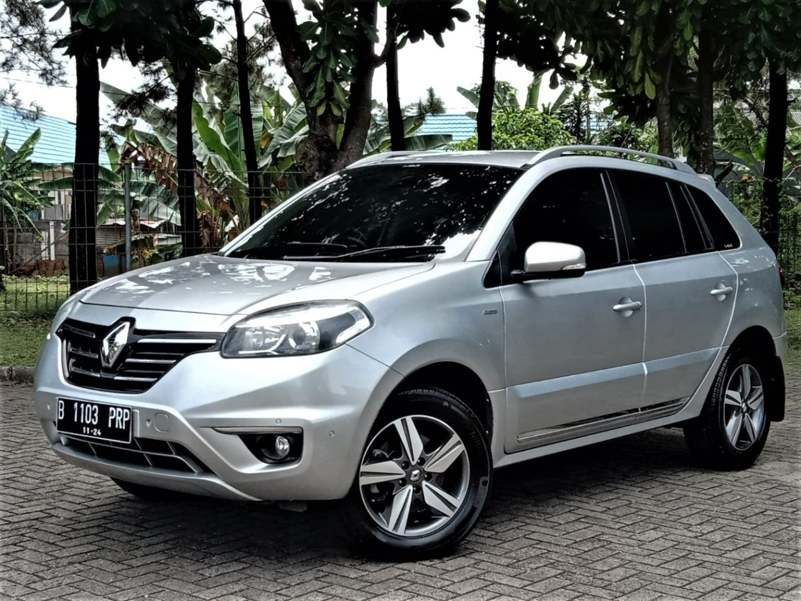
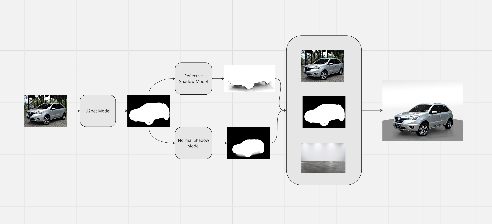

Python version 3.7.5 (Required version of python)

# Introduction 

This repository contains project on background change using Isnet. Which internally uses car part classifier model and licence plate detection to mask licence plate with a custom logo. Shadow models based on pix2pix

# Requirements 

Install requirements
```
gcc & g++ ≥ 5.4 are required
$ pip install -r requirements.txt
```

# Model Trainings
```
Training codes are in relevant folders
```

# Input Image


# Output 


# Model Flowchart

